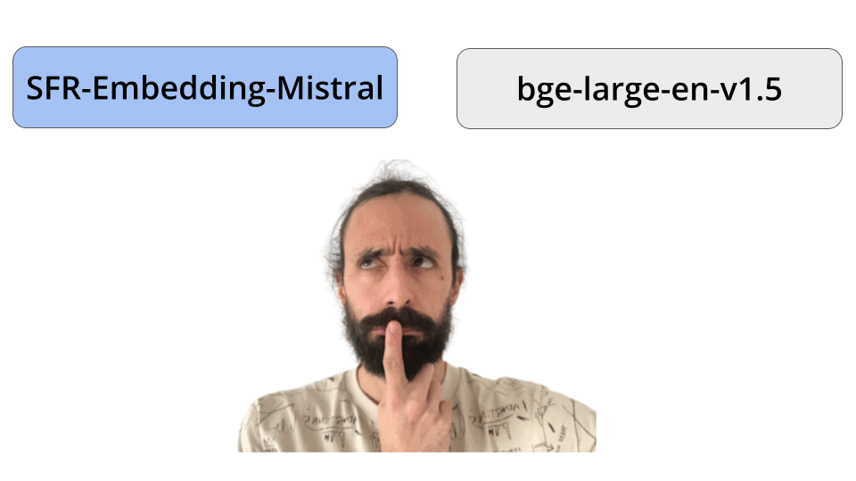

<div align="center">
    <h1>Which embedding model should you use?</h1>    
</div>

<div align="center">
    
  </a>
</div>


#### Table of contents
* [Problem](#the-problem)
* [Solution](#solution)
* [Video lecture](#video-lecture)
* [Wanna learn more real-time ML?](#wanna-learn-more-real-time-ml)


## The problem

Text embeddings are vector representations of raw text that you compute using an embedding model

<div align="center">
    
</div>

These vectors representations are then used for downstream tasks, like

* **Classification** → for example, to classify tweet sentiment as either positive or negative.

* **Clustering** → for example, to automatically group news into topics.

* **Retrieval** → for example, to find similar documents to a given query.

Retrieval (the “R” in RAG) is the task of finding the most relevant documents given an input query. This is one of the most popular usages of embeddings these days, and the one we focus on in this repository.

<div align="center">
    
</div>


There are many embedding models, both open and proprietary, so the question is:

> What embedding model is best form my problem? 🤔


In this repository you can find an evaluation script that helps you find the right embedding model for your use case.


## Solution

To evaluate a model for retrieval using a particular dataset we will

1. Load the model and your dataset from HuggingFace, with
    - questions
    - contexts, and
    - correct answers
2. Embed the context into the Vector DB, in our case Qdrant.
3. For each question retrieve the top `K` relevant documents from the Vector DB
4. 

## Run the code


1. Create an `.env` file and fill in the credentials to connect to the serverles Hopsworks Feature Store
    ```
    $ cp .env.example .env
    ```

2. Build Docker image for each of the pipeline steps: `trade_producer`, `trade_to_ohlc` and `ohlc_to_feature_store`
    ```
    $ make build
    ```

3. Start the pipeline
    ```
    $ make start
    ```

3. Stop the pipeline locally
    ```
    $ make stop
    ```

## Video lecture

```
$ export OPENAI_API_KEY=your_key_goes_here
```

```
$ poetry install
```

```

```

```
$ poetry run python src/evaluate.py
```

```
$ poetry run python src/evaluate.py \
    --model_name 'sentence-transformers/all-mpnet-base-v2'
    --dataset_name 'explodinggradients/ragas-wikiqa'
    --top_k_to_retrieve 10
    --n_rows 100
```

## Wanna learn more Real World ML?
Join more than 15k subscribers to the Real-World ML Newsletter. Every Saturday morning.

→ [Subscribe for FREE 🤗](https://www.realworldml.net/subscribe)